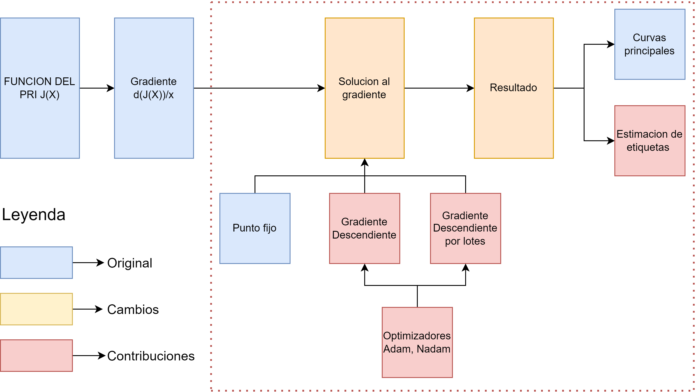
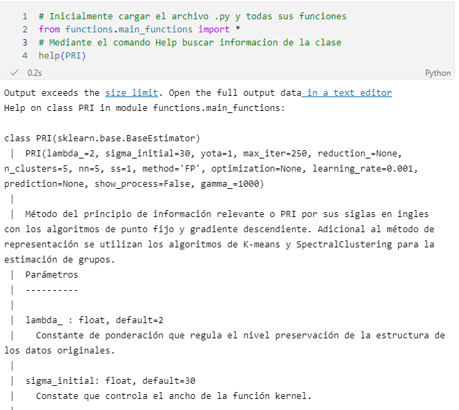

# Tabla de contenido
1. [Objetivo asociado al repositorio](#objetivo)
2. [Principio de Informacion Relevante](#PRI)
    1. [Solucion punto fijo](#FP)
    2. [Solucion gradiente descendiente](#GD)
    3. [Solucion gradiente descendiente por lotes](#batch)
3. [Contribucion y funcionamiento de la clase](#app)
4. [Requerimientos](#req)

## Objetivo especifico #1 

Implementar una estrategia de aprendizaje por teoria de informacion para codificar estructuras regulares de datos utilizando el principio de inofrmacion relevante acoplado a esquemas de optimizacion por gradiente descendiente, en aras de mejorar la capacidad de representacion de los modelos en tareas de agrupamiento y estimacion de curvas principale.

## Principio de Informacion Relevante

El principio de informacion relevante o PRI por sus siglas en ingles es una técnica de aprendizaje no supervisado la cual pretende brindar una solucion a un problema de optimizacion, mediante el balance de la minimizacion de la redundancia de los datos con la distorsión que se genera entre los datos originales y la solución, expresado como: 

$$L[p(x|x_{o})]=min_{X}(H(X)+\lambda D_{KL}(X||X_{o}))$$

Donde $x_{o}\in X_{o}$  corresponde al conjunto de datos originales, $x\in X$ es la versión comprimida del conjunto de datos originales, $\lambda$ es un parámetro variacional, $H(X)$ es la entropía y $D_{KL}(X||X_{o})$ es la divergencia KL entre los datos originales y los datos comprimidos. Dado que el objetivo es generar un conjunto de datos que conserve un nivel de similitud con los datos originales, la funcion procede a minimizarse respecto de L, adicionalmente se ajustan los terminos de entropia y divergencia por temas de conveniencia matematica, dando como resultado:

$$J(X)=min_{X}(H_{2}(X)+\lambda D_{CS}(X,X_{o}))$$

 Con la funcion de costo expuesta se proceden a exponer las diferentes soluciones que se incorporan en el presente repositorio.

## Solucion punto fijo 

 En el libro 'Information Theoretic Learning' el autor propone como solucion para la funcion de costo del PRI el algoritmo de punto fijo, puesto que se complementa muy bien con los estimadores de teoria de informacion (entropia y divergencia) logrando obtener de manera rapida su derivada y utilizando solo los parametros de $/lambda$ y $/sigma$, siendo este ultimo un parametro implicito en las funciones nucleo

$$D_{CS}(X,X_{o}) = 2H_2(X,Xo)-H_{2}(X)-H_2(X_{o})$$

Reemplazando y agrupando en la funcion de costo se tiene:

$$ J(X)=min_{x}[(1-\lambda)H_{2}(X)+2\lambda H_{2}(X,X_{o})-H_2(X_{o})]$$

Al minimizar la funcion y eliminar las constantes:

$$ J(X)=min_{x}[(1-\lambda)H_{2}(X)+2\lambda H_{2}(X,X_{o})]$$

Contemplando el dominio de valores de $\lambda| $ $1<\lambda<\infty$

$$J(X)=min_{x}[-(1-\lambda)log(V(X))-2\lambda log(V(X,X_{o}))]$$

Sustituyendo los terminos de potenciales

$$ J(X)= min_{x}\left[ -(1-\lambda)\log\left(\frac{1}{N^{2}}\sum_{i=1}^{N}\sum_{j=1}^{N}G_{\sigma}(x_{i}-x_{j} )\right)-2\lambda\log\left(\frac{1}{NN_{o}}\sum_{i=1}^{N}\sum_{j=1}^{N_{o}}G_{\sigma}(x_{i}-x_{oj}\right) \right]$$

derivando la ecuacion

$$\frac{d J(X)}{dx_{k}}=\frac{2(1-\lambda)}{V(X)}F(x_{k})+\frac{2}{V(X,X_{o})}F(x,X_{o})=0$$

Donde $F(x_{k})$ y $F(x,X_{o})$ estan definidos como:

$$F(x_{k})=\frac{-1}{N \sigma^{2}}\sum_{j=1}^{N}G_{\sigma}(x_{k}-x_{j})(x_{k}-x_{j})$$ 
$$F(x;X_{o})=\frac{-1}{N_{o} \sigma^{2}}\sum_{j=1}^{N_{o}}G_{\sigma}(x_{k}-x_{oj})(x_{k}-x_{oj})$$ 

Para esta metodologia se despeja la derivada en terminos de $x_{k}$, dando como resultado:

$$\frac{(1-\lambda)}{NV(X)}\sum_{j=1}^{N}G_{\sigma}(x_{k}-x_{j})(x_{j}-x_{k})=\frac{\lambda}{N_{o}V(X,X_{o})}\sum_{j=1}^{N_{o}}G_{\sigma}(x_{k}-x_{oj})(x_{k}-x_{oj})$$

$$x_{k}(n+1)=c\frac{(1-\lambda)}{\lambda}\frac{\sum_{j=1}^{N}G_{\sigma}(x_{k}-x_{j})x_{j}}{\sum_{j=1}^{N_{o}}G_{\sigma}(x_{k}-x_{oj})}+\frac{\sum_{j=1}^{N_{o}}G_{\sigma}(x_{k}-x_{oj})x_{oj}}{\sum_{j=1}^{N_{o}}G_{\sigma}(x_{k}-x_{oj})}-c\frac{(1-\lambda)}{\lambda}\frac{\sum_{j=1}^{N}G_{\sigma}(x_{k}-x_{j})x_{k}}{\sum_{j=1}^{N_{o}}G_{\sigma}(x_{k}-x_{oj})}$$
Donde el parametro $c$ corresponde a:

$$c=\frac{N_{o}V(X,X_{o})}{NV(X)}$$ 

## Solucion gradiente descendiente 

Como parte de la propuesta del repositorio, inicialmente se incorpora la solucion del gradiente descendiente, el cual brinda una escalabilidad a la solucion anteriormente propuesta, ademas de la presuncion de rapidez en terminos de convergencia, dicha solucion se expresa mediante:

$$x_{k+1}=x_{k}-\gamma \frac{d J(X)}{dx_{k}}$$

Recordando que:

$$\frac{d J(X)}{dx_{k}}=\frac{2(1-\lambda)}{V(X)}F(x_{k})+\frac{2}{V(X,X_{o})}F(x,X_{o})=0$$

Reemplazando:

$$x_{k+1}=x_{k}-\gamma\left( \frac{2(1-\lambda)}{V(X)}F(x_{k})+\frac{2}{V(X,X_{o})}F(x,X_{o})\right)$$

Donde $\gamma$ es el coeficiente de aprendizaje o el paso del gradiente en cada iteracion, reemplazando los terminos de potenciales:

$$x_{k+1}=x_{k}-\gamma c\left( (1-\lambda)\frac{\sum_{j=1}^{N}G_{\sigma}(x_{k}-x_{j})(x_{k}-x_{j})}{\sum_{i=1}^{N}\sum_{j=1}^{N}G_{\sigma}(x_{i}-x_{j})} + \frac{\sum_{j=1}^{N_{o}}G_{\sigma}(x_{k}-x_{oj})(x_{k}-x_{oj})}{\sum_{i=1}^{N}\sum_{j=1}^{N_{o}}G_{\sigma}(x_{i}-x_{oj})}\right)$$

Donde $c$ es igual a:

$$c=\frac{2N}{\sigma^2}$$

## Solucion gradiente descendiente por lotes 

Como una solucion adicional a la funcion de costo del PRI, se añade el algoritmo de gradiente descendiente por lotes, el cual basicamente es una variacion del gradiente descendiente, siendo esta variacion la seleccion de un 'lote' o subconjunto del conjunto de entrenamiento, pretendiendo con esto lograr mejor estabilidad en terminos de convergencia y mayor eficiencia computacional. su solucion esta dada por:  

$$x_{k+1}=x_{k}-\gamma \frac{d J(X^i)}{dx_{k}}$$

Notese que la solucion es similar a la del gradiente descendiente, con diferencia que en este algoritmo se selecciona un subconjunto de la variable $X$.

## Contribucion y funcionamiento de la clase 
1. <b>Contribucion</b>: 
Para ilustrar el diseño de la clase implementada en el respositorio, se utiliza la siguiente grafica:

Notese que la estructura del PRI junto con su componentes se conservan intactos, es en la solucion donde se realizan las contribuciones, adicionando dos alternativas como son: el gradiente descendiente y el gradiente descendiente por lotes. De igual manera, se pone a disposicion del usuario el uso de optimizadores para las tecnicas de los gradientes, como lo son el Nadam y el Adam. Finalmente, en la seccion de resultados se complementa el PRI con algoritmos como el SpectralCLustering o el Kmeans para brindar la facultad de estimacion de estiquetas, brindando a la metodologia inicial alcances de caracter supervisado, sin embargo su naturaleza no supervisada se mantiene entregando versatilidad al usuario y sus necesidades.

2. <b>Funcionamiento</b>: Con la finalidad de conocer mas acerca de la funcion y sus parametros se ilustra de manera interactiva la manera de acceder al menu de ayuda de la clase, alli encontrara una descripcion completa de la mismaa, desde sus entradas hasta sus salidas y como configurarlas de acuerdo a sus necesidades:

Por cuestiones esteticas y de espacio en esta seccion no se ilustra todo el contenido del comando 'help' implementado. Adicionalmente, puede encontrar una guia didactica del funcionamiento de la clase en el notebook con nombre 'Cuaderno_guia.ipynb'
.

## Requerimientos 

Para el correcto funcionamiento de la clase se le sugiere revisar la lista de requerimientos de librerias ilustradas en el archivo 'requirements.txt'.

