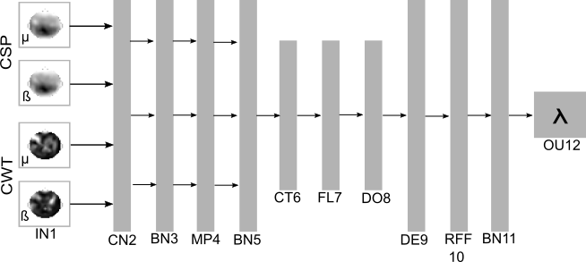

# Tabla de contenido
1. [Primer objetivo asociado al repositorio](#objetivo)
2. [Diseño de la red Deep and Wide](#CNNDW)
    1. [Maquinas Kernel](#RFF1)
    2. [Random features](#RFF2)
    3. [Fine tuning](#RFF3)
    4. [Ejemplo de kernel Gaussiano](#RFF4)
3. [Segundo objetivo asociado al repositorio](#objetivo2)
4. [Mapas de atencion](#AM)
    1. [GradCam](#GC)
    2. [ScoreCam](#SC)
    3. [Saliency](#Sa)
5. [Contribucion y funcionamiento](#app)
6. [Requerimientos](#req)

## Objetivo especifico #2 

Desarrollar una metodología de clasificación basada en aprendizaje profundo y regularizadores por teoría de información, que involucren mapeos a espacios de Hilbert con núcleo reproductivo para codificar estructuras relevantes de datos y mitigar la alta variabilidad de las predicciones en escenarios con pocas muestras e incertidumbre en las etiquetas.

## Diseño de la Red amplia y profunda

La propuesta para el presente objetivo consiste en el desarrollo de una red neuronal convolucional, de tipo amplia y profunda (aunque tambien se puede trabajarse solo en modo profundo), la cual integre en su funcion de costo metodologias basadas en teorias de informacion, con la finalidad de que se mejore la etapa de clasificacion mediante la reduccion de incertidumbre que se tiene en las etiquetas o en escenarios de gran variabilidad. Para tal fin, se procede a describir la red que es expuesta a continuacion 

- <b>IN1:</b> Capa de entrada, la cual puede trabajarse en modo amplio y profundo, o exclusivamente profundo.  
- <b>CN2:</b> Primer capa de convolucion.
- <b>BN3:</b> Primer capa de normalizacion. 
- <b>MP4:</b> Primer capa de pooling.
- <b>BN5:</b> Segunda capa de normalizacion.
- <b>CT6:</b> Capa de concatenacion.
- <b>FL7:</b> Capa de flatten o aplanamiento.
- <b>DO8:</b> Capa de dropout.
- <b>DE9:</b> Capa densa.
- <b>RFF:</b> Capa RFF.
- <b>BN11:</b> capa de normalizacion.
- <b>OU12:</b> capa de densa de salida.

Del anterior diseño se destacan dos etapas. La primera que consiste en la representacion de datos mediante una funcion kernel (capa RFF10), en esta se pretende explotar la correlacion espacial de las imagenes de entrada, para el cual una capa kernel de la forma $N \times N$ explora la relacion de patrones espaciales, adicionalmente permite representar los datos sin la limitante que tienen las funciones kernel y su dimensionalidad que tiende al infinito, aspecto que brinda un grado de libertad a la red neuronal, como tambien la capacidad de con esta capa incorporar funciones basadas en teorias de informacion. Para comprender mejor el concepto de la capa RFF se recomienda observar los indices: Maquinas Kernel, Random features, fine tuning y Ejemplo kernel Gaussiano. La segunda etapa consiste en la salida de la red neuronal, la etapa de clasificacion, donde la funcion de costo se expresa mediante:

$$L(y,\hat{y}|X)=\lambda H(y;\hat{y})+(1-\lambda)H_2(K(X,X'))$$

Variables:

$y: Etiquetas$ 
$\hat{y}: Etiquetas\ estimadas$ 
$X: Instacias\ originales$ 
$X': Instacias\ procesados $

De la anterior ecuacion se resalta la semejanza con la función de costo establecida en el método del principio de informacion relevante [PRI](https://github.com/Bryan0122/Maestria-ITL/tree/main/Primer%20Objetivo), donde partiendo del mismo principio se decide expandir el enfoque, siendo para este caso, el uso de dicha funcion en tareas de carácter semi-supervisado. Incialmente, la primer mitad de la ecuacion hace alusion a una ecuacion de naturaleza supervisada, pues expresa la relacion entre el conjunto de etiquetas objetivo y su respectiva estimacion. Seguidamente, en la segunda mitad de la ecuacion se evidencia una parte de control de estructura, que es la parte no supervisada, donde  se busca brindar solidez en la estructura de los datos y restar importancia a la etiquetas, reiterando la premisa de incertidumbre en el etiquetado para instancias de gran variabilidad. Cabe resaltar que es en esta ultima etapa donde la capa RFF desarrolla un papel fundamental al elaborar la funcion kernel que se incorpora posteriormente en la función de entropia.

## Maquinas Kernel

Considera un problema de aprendizaje con instacias y etiquetas ${(x_n, y_n)}_{n=1}^N$, donde $x_n \in X$ y $y_n \in Y$, ignorando el bias, un modelo lineal encuentra el hiperplano $w$ tal que la funcion de decision sea optima para cierta funcion de costo.
$$f^*(x)=w^\intercal x (1)$$

Sin embargo, los modelos lineales tienen limitaciones, en especial cuando los datos no son linealmente separables para su clasificacion o no existe una relacion lineal entre las instancias y las etiquetas para la tarea. Como alternativa a tales limitaciones, existen metodos como las maquinas kernel o tambien conocidos como metodos kernel, donde el conjunto de entrada $X$ es mapeado dentro de otro espacio $V$ in el cual las etiquetas pueden ser una funcion lineal de los datos. Sin embargo, la dimension de $V$ puede tener una dimension muy alta o incluso infinita, para lo cual entre los metodos kernel se previene operar explicitamente en ese espacio mediante el uso del 'kernel trick', el cual establece que si $k: X \times X \rightarrow \mathbb{R}$ es un kernel definido positivo, entonces por el teorema de Mercer existe una funcion base o 'feature map' $\varphi:X\rightarrow V$ de manera que:
$$k(x,y)=<\varphi(x),\varphi(y)>v (2)$$
$<\cdot,\cdot>v$ es el producto interno en $V$. Dado lo anterior, mediante el kernel trick y el teorema de representacion, los metodos kernel construyen modelos no lineales de $X$ que son lineales en $k(\cdot,\cdot)$

$$f^*(x)=\sum_{i=1}^N\alpha_n k(x,x_n)=<w,\varphi(x)>v(3)$$ 

Si $f^*(\cdot)$ denota el optimo de $f(\cdot)$. Se pueden juntar las ecuaciones (2) y (3), afirmando que teniendo una funcion kernel, la cual es dfinidamente positiva $k(\cdot,\cdot)$, se puede evitar operar bajo la posibilidad del espacio de dimension infinita $V$ y en cambio solo calcular sobre las $N$ instancias o muestras. Lo anterior tiene sentido debido a que la regla de decision optima puede ser expresada como una expansion en terminos de las instacias de entrenamiento.

## Random features

En el escrito publicado en 2007, 'Random Features for Large-Scale Kernel Machines (Rahmi & Recht, 2007)' se propone un enfoque diferente, el cual consiste en aproximar el mapa aleatorio expuesto en (2) con un mapa aleatorio $z: \mathbb{R}^D\rightarrow \mathbb{R}^R$ donde idealmente $R \ll N$.

$$k(x,y)=<\varphi(x), \varphi(y)>\approx z(x)^\intercal z(y)$$

Porque esta aproximacion es una buena idea y porque funciona? el teorema de representacion indica que la solucion optima es la suma de funciones kernel ponderadas en nuestras observaciones. Por tanto, si tenemos una buena aproximacion $\varphi(\cdot)$, entonces 

$$f^*(x)=\sum_{n=1}^N\alpha_nk(x_n,x)$$

$$=\sum_{n=1}^N\alpha_n<\varphi(x_n),\varphi(x)>$$

$$\approx\sum_{n=1}^N\alpha_n z(x_n)^\intercal z(x)$$

$$=\beta^\intercal z(x)$$

Dado la funcion $z(\cdot)$ se puede afirmar que es una buena aproximacion de $\varphi(\cdot)$, por tanto, se puede simplemente proyectar los datos utilizando $z(\cdot)$. Finalmente, la tarea consiste en encontrar una proyeccion aleatoria $z(\cdot)$ tal que, dicha proyeccion aproxime la maquina kernel correspondiente.
La anterior formula nace de la observacion. Donde se considera $w$ como un vector D dimensional tal que:

$$w\sim \mathcal{N}_D(O,I)$$

ahora se define $h$ como

$$h:x\rightarrow \exp(iw^\intercal x)$$

de la formula anterior $i$ hace referencia a la unidad imaginaria. Ahora, denotando la conjugada compleja con $*$ se tiene

$$E_w[h(x)h(y)^*]=E_w[\exp(iw^\intercal(x-y))]$$

$$=\int_{\mathbb{R}^D}p(w)\exp(iw^\intercal(x-y))dw$$

$$=\exp\left(-\frac{1}{2}(x-y)^\intercal(x-y)\right)$$

En otras palabras, el valor esperado de $h(x)h(y)^*$ es el kernel gaussiano, lo cual a su vez una  instacia especifica de un resultado mas general, el cual consiste en el teorema de Bochner, que indica
 - <b>Teorema de Bochner:</b> Un kernel continuo $k(x,y)=k(x-y)$ en $\mathbb{R}^D$ es positivo definido si y solo si $k(\Delta)$ es la transformada de Fourier de una medida no negativa.

La transformada de Fourier de una medida no negativa, $p(w)$ es:

$$k(\Delta)=\int p(w)\exp(iw\Delta)dw$$ 

Rahimi y Recht observaron que muchos de los kernels, como el gaussiano (o las funciones bases radiales), son invariantes al desplazamiento. Para brindar un marco general de aproximacion a cualquier funcion que posea un kernel con caracteristicas de invariabilidad al desplazamiento inicialmente se re define la funcion $h(\cdot)$ y adicionalmente se re define $w$ verificando que cumpla una medida no negativa para $p(w)$, no solo la Gaussiana. Finalmente, si se toman $\mathbf{R}$ muestras independientes e identicamente distribuidas $\{w_r\}_{r=1}^R$

$$k(x,y)=k(x-y)$$

$$=\int p(w)\exp(iw^\intercal(x-y))dw$$

$$=E_w[\exp(iw^\intercal(x-y))]$$

$$\approx\frac{1}{R}\sum_{r=1}^R\exp(iw^\intercal(x-y))$$

$$=\begin{bmatrix} 
\frac{1}{\sqrt{R}}\exp\left(iw_1^\intercal x\right)\\ 
\frac{1}{\sqrt{R}}\exp\left(iw_2^\intercal x\right)\\ 
\vdots\\ 
\frac{1}{\sqrt{R}}\exp\left(iw_R^\intercal x\right) 
\end{bmatrix} 
\begin{bmatrix} 
\frac{1}{\sqrt{R}}\exp\left(iw_1^\intercal y\right)\\ 
\frac{1}{\sqrt{R}}\exp\left(iw_2^\intercal y\right)\\ 
\vdots \\ 
\frac{1}{\sqrt{R}}\exp\left(iw_R^\intercal y\right)
\end{bmatrix}$$

$$=h(x)h(y)^*(2)$$

El paso realizado en (1) es una aproximacion Monte Carlo de la esperanza. El paso (2) es la definicion de un mapa aleatorio $h: \mathbb{R}^D\rightarrow\mathbb{R}^D$. Note que inicialmente se menciono el producto $z(x)^\intercal z(y)$ pero en la formula anterior se tiene $h(x)h(y)^*$. Sin embargo a continuacion se procede a eliminar la parte imaginaria y la nueva transformada es la que Rahimi y Recht llamaron $z$.

## Fine tuning

Ahora que se comprende la gran idea de un mapa de baja dimension y aleatorio y el porque este funciona, se procede a profundizar el concepto. Iniciando con la distribucion normal $\mathcal{N}_D(O,I)$ y el kernel $k(\Delta)$

$$\exp(iw^\intercal(x-y))=\cos(w^\intercal(x-y))-i \sin(w^\intercal(x-y))$$

$$=\cos(w^\intercal(x-y))$$

Ahora definiendo $z_w(x)$

$$w\sim p(w)$$

$$b\sim Uniform(0,2\pi)$$

$$z_w(x)= \sqrt{2}\cos(w^\intercal x+b)$$

Lo anterior se afirma porque 

$$E_w[z_w(x)z_w(y)]=E[\sqrt{2}\cos(w^\intercal x+b)\cos(w^\intercal y+b)]$$

$$=E_w[\cos(w^\intercal (x+y)+2b)]+E_w[\cos(w^\intercal (x-y))]$$

$$=E_w[\cos(w^\intercal(x-y))]$$

Ahora se procede a definir un mapa aleatorio $z:\mathbb{R}^D\rightarrow\mathbb{R}^R$ tal que $k(x,y)=<\varphi(x), \varphi(y)>\approx z(x)^\intercal z(y)$

$$z(x)=\begin{bmatrix}
\frac{1}{\sqrt{R}}z_{w_1}\left(iw_1^\intercal x\right)\\ 
\frac{1}{\sqrt{R}}z_{w_2}\left(iw_2^\intercal x\right)\\ 
\vdots \\ 
\frac{1}{\sqrt{R}}z_{w_R}\left(iw_R^\intercal x\right)
\end{bmatrix}$$

Por lo tanto

$$z(x)^\intercal z(y)=\frac{1}{R}\sum_{r=1}^Rz_{w_r}(x)z_{w_r}(y)$$

$$=\frac{1}{R}\sum_{r=1}^R2\cos(w_r^\intercal x+b_r)\cos(w_r^\intercal y+b_r)$$

$$=\frac{1}{R}\sum_{r=1}^R\cos(w_r^\intercal(x-y))$$

De la ecuacion anterior se tiene un algoritmo pora estimar un kernel definido positivo invariante al desplazamiento. Mediante el uso de $R$ muestras de $w\sim p(w)$ y $b\sim Uniform(0,2\pi)$ y luego calculando $z(x)^\intercal z(y)$

## Ejemplo de kernel Gaussiano

Se procede a realizar la aproximacion del kernel gaussiano usando Random Fourier Features. Para tal fin, se utilizan $R$ muestras  $w$ las cuales estan identicamente distribuidas e independientes, posteriormente.

$$z(x)^\intercal z(y) = \frac{1}{R} \sum_{r=1}^Rz_{w_r}(x)z_{w_r}(y) =  \frac{1}{R}\sum_{r=1}^R\cos(w_r^\intercal(x-y))$$

para cada par $(x,y)$ El objeto resultante de $N \times N$ es aproiximado a la matris de covarianza inducido por la funcion del kernel Gaussiano. Concretamente $\mathbf{Z}_X$ denota $z(\cdot) aplicado a todas las $N$ muestras de $x_n$. Dado que  $\mathbf{Z}_X$ es de dimensiones $N \times R$ se tiene 

$$\mathbf{K}_X\approx \begin{bmatrix}
z(x_1)\\  
\vdots \\ 
z(x_N)
\end{bmatrix} \begin{bmatrix}
z(x_1)&  
\cdots & 
z(x_N)
\end{bmatrix} = \mathbf{Z}_X\mathbf{Z}_X^\intercal$$

LLevando a la practica lo expuesto se tiene que a mayor dimension de R la similitud con la funcion kernel es mayor, dando por finiquitado la demostracion y explicacion de Random Fourier Features

## Objetivo especifico #3 

Implementar estrategias de análisis de relevancia basadas en mapas de activación de clase, para cuantificar la importancia de las características de entrada que alimentan la metodología de clasificación basada en aprendizaje profundo y regularizadores por teoría de información.

## Mapas de atencion 

Los modelos basados en redes neuronales tienen un buen rendimiento en gran variedad de dominios, tales como vision por computador, sistemas de recomendacion, procesamiento del lenguaje natural, etc. Sin embargo, en areas como salud, finanzas y defensa, dichos modelos fallan en cuanto a explicabilidad, razon por la cual, para el caso especial de analisis se han implementado mecanismos que encuentra la region mas importante en terminos de la tarea de clasificacion de acuerdo a la imagen de entrada, donde dicha zona revela que zonas de la imagen son cruciales para al modelo al momento de tomar una decision, develando informacion importante acerca de la red, su comportamiento y de la tarea que se esta desarrollando. Para abordar estos mecanismos se exponen las siguientes alternativas:

## GradCam

En terminos generales se inicia calculando el gradiente de $y^c$ con respecto a los mapas de caracteristicas $A$ de la capa convolucional. Dichos gradientes retornar a un promerio global obteniendo los pesos 

$$\alpha^c_k=\frac{1}{Z}\sum_i\sum_j \frac{\partial y^c}{\partial A^k_{ij}}$$

- $Z$ es el numero total de caracteristicas .
- $y^c\rightarrow$ Puntaje ded activacion de la clase $c$.
- $\alpha^c_k$ Representa una linealizacioon parcial de la red neuronal desde el mapa de caracteristicas $A$ y captura la importancia del mapa de caracteristicas.

Finalmente el mapa de calor res una combinacion de el mapa de caracteristicas con los pesos pero integrados en una funcion RELU
$$L^c_{Grad-Cam}=ReLU\left(\sum_k\alpha^c_kA^k\right)$$

- La moticavion para usar la Relu consiste en el interes de las caracteristicas con una influencia positiva en la clase de interes, es decir, en los pixeles cuya intensidad se incrementa en medida que $y^c$ incrementa.

## ScoreCam

Dada una CNN $Y =f(X)$ que toma una entrada $X$ y salidas $Y$. Se toma inicialmente una capa convolucional $l$ en $f$ y la correspondiente activacion $A$. 

$$C(A_l^k)=f(X\circ H_l^k)-f(X_b)$$

donde

$$H_l^k = s(Up(A_l^k))$$

$Up(\cdot)$ denota la operacion que sobremuestrea $A_l^k$ en el tamaño de entrada y $s(\cdot)$  es una funcion de normalizacion que ajusta cada elemento de la matriz de entrada de $[0,1]$

$$s(A_l^k)= \frac{A_l^k-min A_l^k}{max A_l^k- min A_l^k} $$

- La parte de normalizacion incrementa la confianza en la funcion, lo cual resulta esencial para la creacion de una mascara binaria

$$L_{Score-CAM}^c= relu \left( \sum_k \alpha_k^c A_l^k\right)$$

$$\alpha_k^c=C(A_l^k)$$

## Saliency

Saliency genera un mapa de prominencia compartiendo conceptos de Grad-CaM, siguiendo la siguiente filosofia
$$L_{ij}^c = relu \left(\sum_k w_k^c A_{ij}^k \right)$$

## Contribucion y funcionamiento

